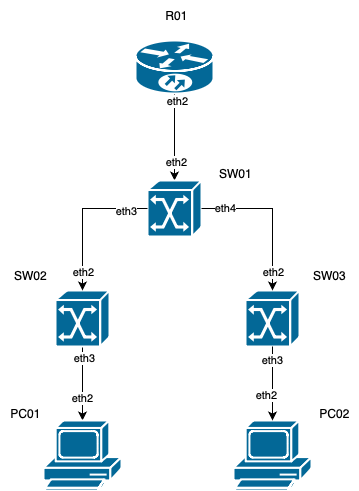
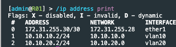
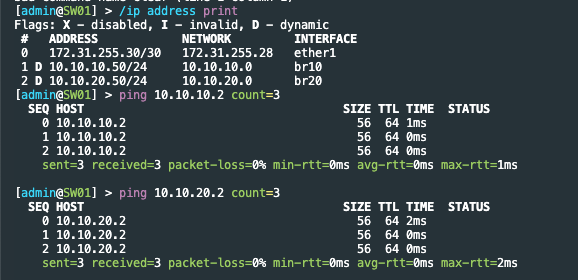
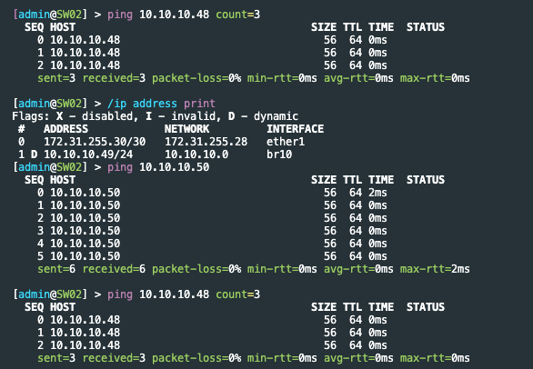
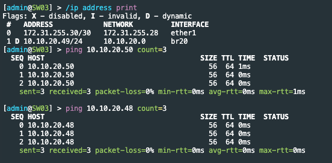
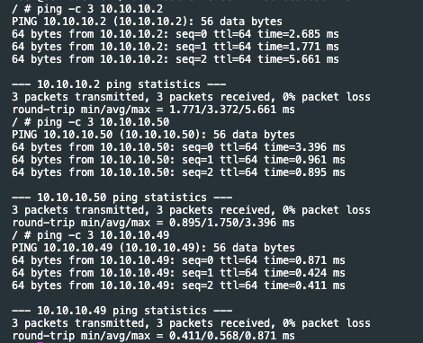
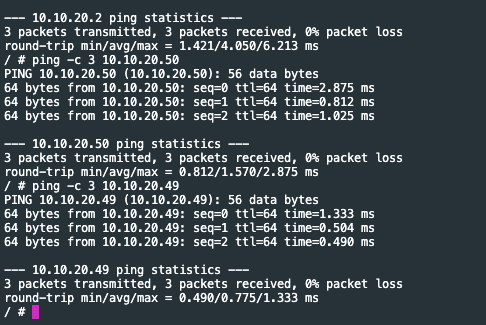

University: [ITMO University](https://itmo.ru/ru/)
Faculty: [FICT](https://fict.itmo.ru)
Course: [Introduction in routing](https://github.com/itmo-ict-faculty/introduction-in-routing)
Year: 2024/2025
Group: K3320
Author: Skvorcov Ivan Vladimirovich
Lab: Lab1
Date of create: 24.09.2024
Date of finished: 25.09.2023

# Топология сети

Топологию сети можно увидеть в файле `lab1.clab.yaml`. В нем мы можем увидеть два типа устройств:
- r-os, представляет из себя сетевое устройоство на базе OC router os
- linux, предствялет из себя эмуляцию пк на linux. Был взят alpine образ

Так же графическое представление топологии можно увидеть ниже

Для каждого устройства так же был прописан свой ip адрес внутри management network с целью
доступа с хост машины. 

# Проверка работоспособности

Посмотрим ip адреса, назначенные на **R01**

Перейдем к **SW01**. Среди ip адресов можно заметить адрес с литерой D, то есть он был выдан автоматически. Так же можем увидеть успешные пинги. 

Аналогичные операции проделаем для **SW02** и **SW03**. Так же проверим, пингуют ли они PC01
(10.10.10.48) и PC02(10.10.20.48) соотвественно.

Теперь проверим, что **PC01** и **PC02** на linux так же коректно настроены. Ниже 
можно увидеть скриншоты успешных пингов.

Кроме того пк между собой не пингуются, так как находятся в разных влан 

# Выводы

В данной работы мы настроили трехуровневую сеть классического предприятия. В ходе
работы мы так же познакомились с containerlab а так же с системой router os