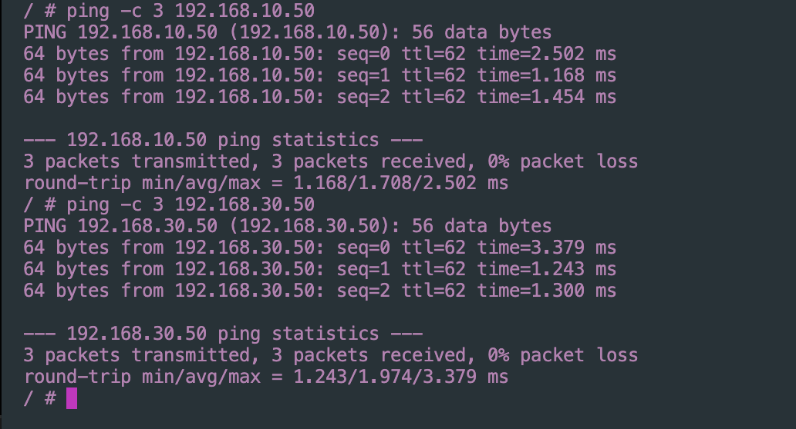

University: [ITMO University](https://itmo.ru/ru/) \
Faculty: [FICT](https://fict.itmo.ru) \
Course: [Introduction in routing](https://github.com/itmo-ict-faculty/introduction-in-routing) \
Year: 2024/2025 \
Group: K3320 \
Author: Skvorcov Ivan Vladimirovich \
Lab: Lab1 \
Date of create: 15.10.2024 \
Date of finished: 16.10.2024

# Топология сети
 
Ниже представлена топология сети

На ней мы видим 3 пк, расположеных в разных городах. 
Между ними надо настроить сеть, чтобы можно было 
общаться между пк.

Ниже будут представлены конфигурации роутеров

**R01_MSK**

**R02_BRL**

**R03_FRT**

# Работоспособность 

Для проверки работоспособности попробует достучаться
с каждого Пк до двух других

**PC01**

**PC02**

**PC03**

Как мы видим, все успешно пингуется
