University: [ITMO University](https://itmo.ru/ru/)

Faculty: [FICT](https://fict.itmo.ru)

Course: [Introduction in routing](https://github.com/itmo-ict-faculty/introduction-in-routing)

Year: 2024/2025

Group: K3320

Author: Skvorcov Ivan Vladimirovich

Lab: Lab3

Date of create: 20.12.2024

Date of finished: 24.12.2024

# Отчёт по лабораторной работе №3 "Эмуляция распределенной корпоративной сети связи, настройка OSPF и MPLS, организация первого EoMPLS"

Создадим конфигурацию в файла ```lab3.clab.yaml```. Тополгоию можно увидеть ниже

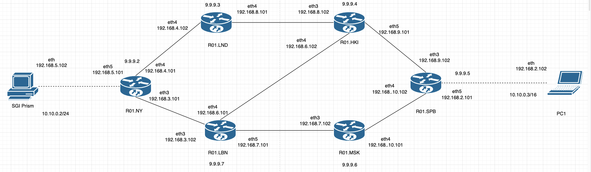

## Конфигурация

**HKI** 
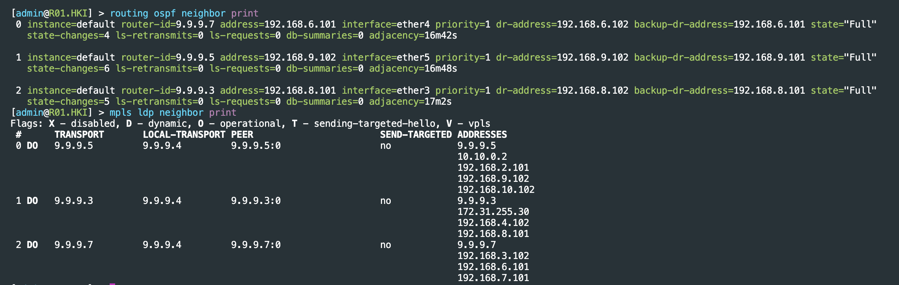

**LBN**
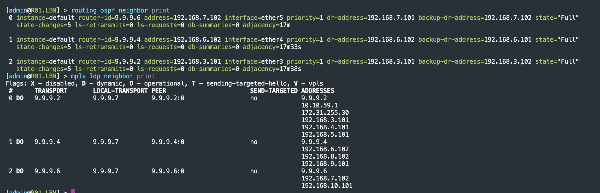

**LND** 
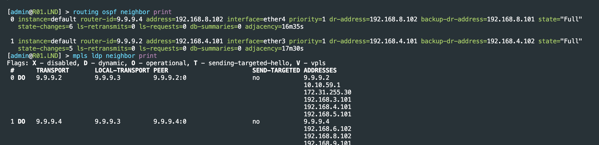

**MSK**
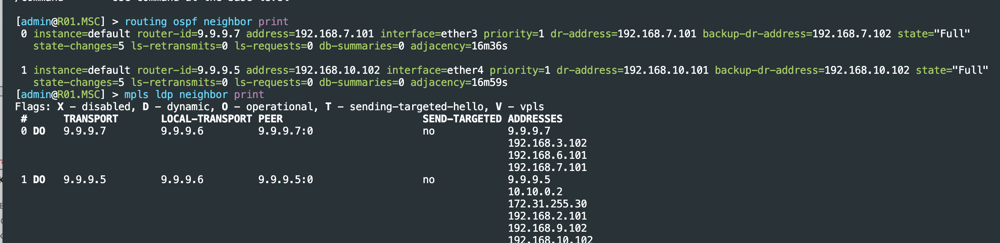

**NY**
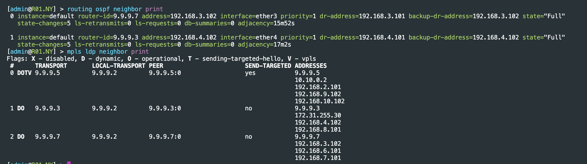

**SPB**
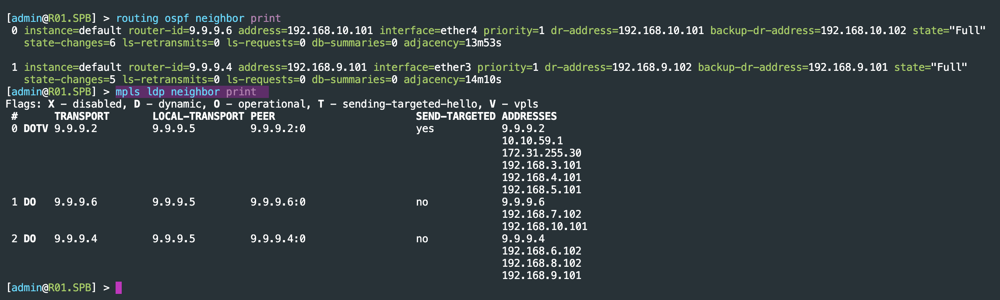

## Пинги

Теперь проверим, что все работает

**PC to SGI**

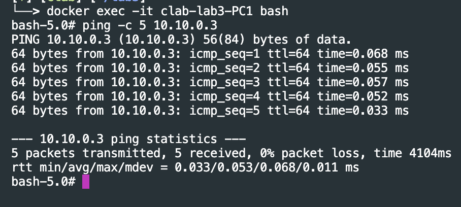

**SGI to PC**

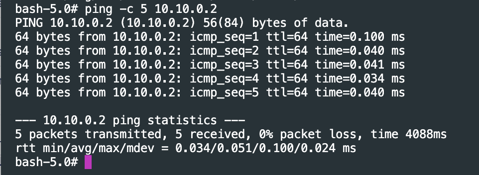

**R01.SPB to 192.168.4.101 and 192.168.3.101**
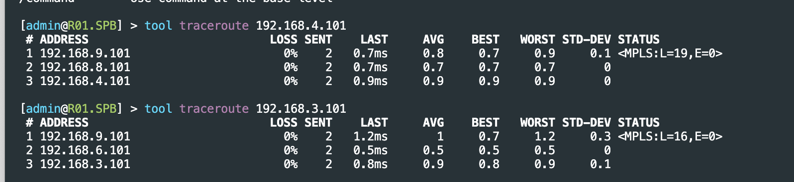

**NY <-> SPB**
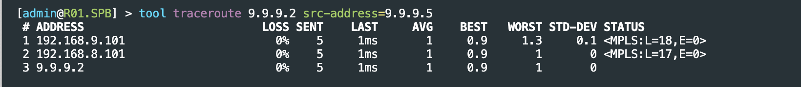
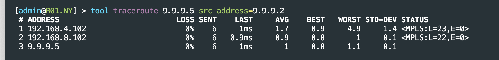
