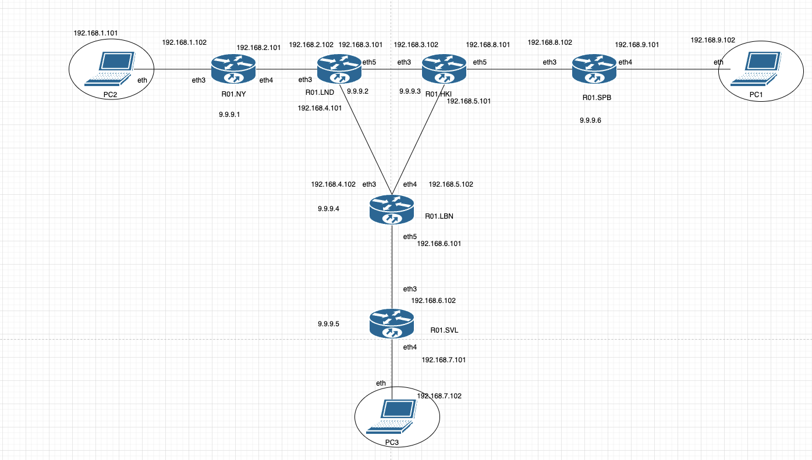
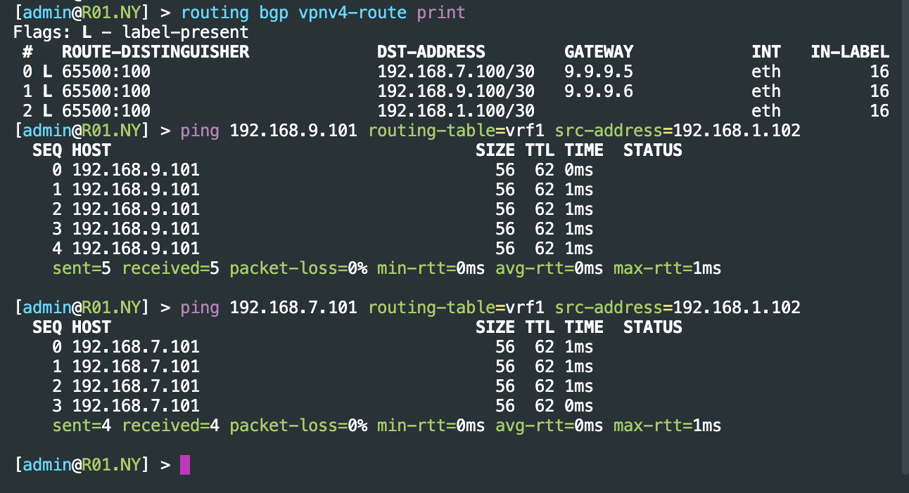
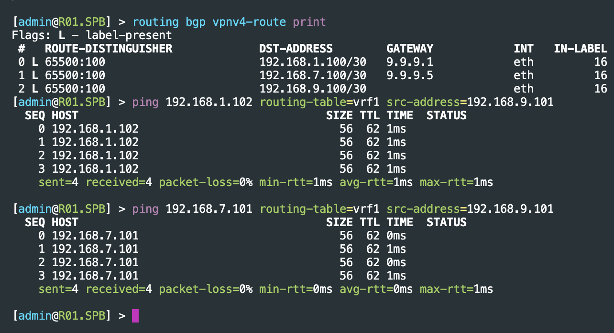
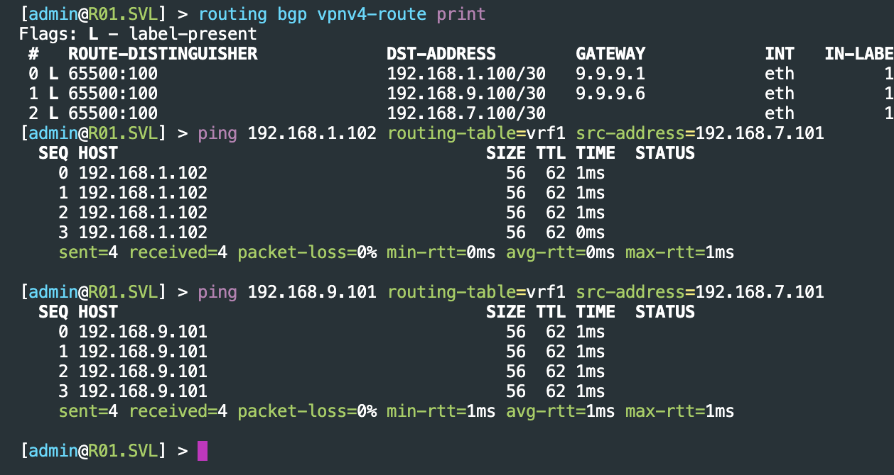
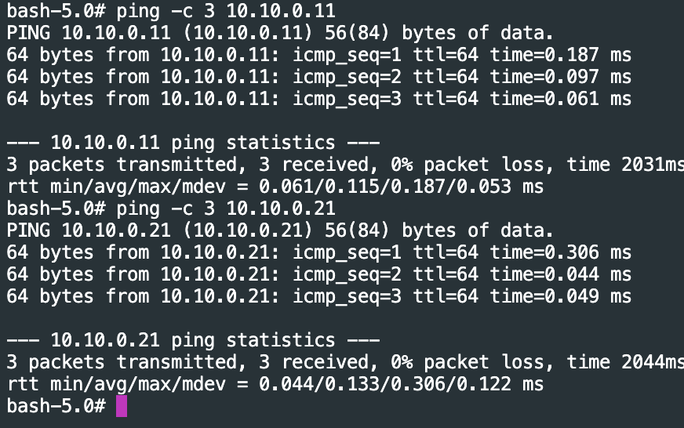
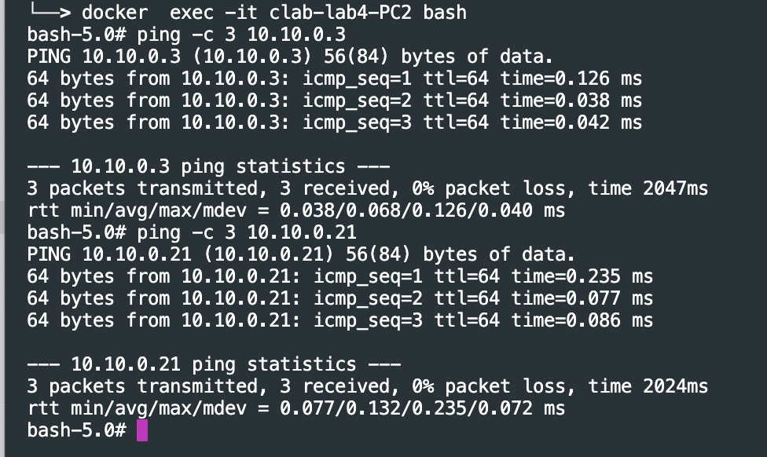
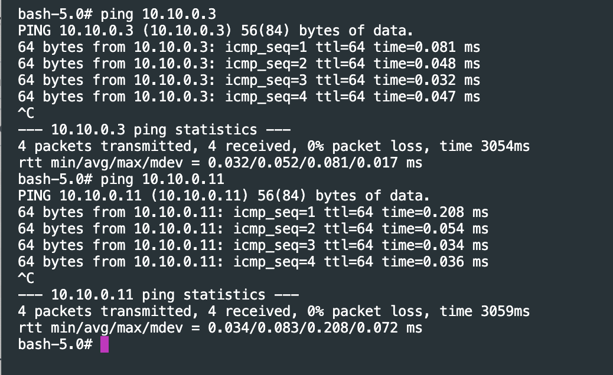

University: [ITMO University](https://itmo.ru/ru/)

Faculty: [FICT](https://fict.itmo.ru)

Course: [Introduction in routing](https://github.com/itmo-ict-faculty/introduction-in-routing)

Year: 2024/2025

Group: K3320

Author: Skvorcov Ivan Vladimirovich

Lab: Lab4

Date of create: 23.12.2024

Date of finished: 24.12.2024

# Отчёт по лабораторной работе №4 "Эмуляция распределенной корпоративной сети связи, настройка iBGP, организация L3VPN, VPLS"

Создадим топологию. Ее схему можно видеть нижу

## Часть 1 

**Пинг из R01.NY в R01.SPB и R01.SVL:**

**Пинг из R01.SPB в R01.NY и R01.SVL:**

**Пинг из R01.SVL в R01.NY и R01.SPB:**

## Часть 2

**PC1 to PC2, PC3**

**PC2 to PC1, PC3**

**PC3 to PC2, PC1**
